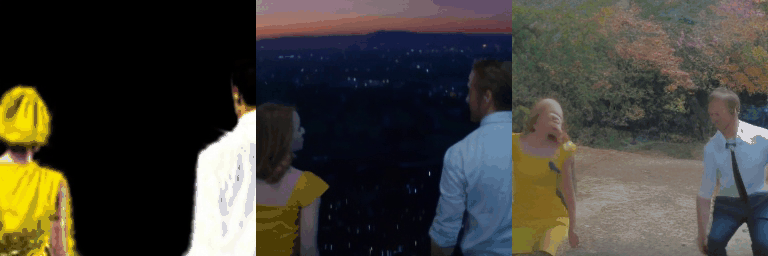
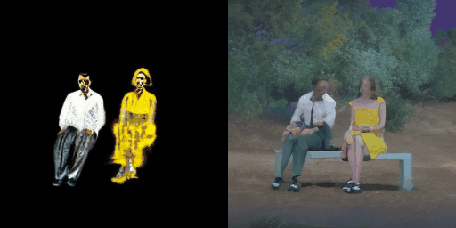
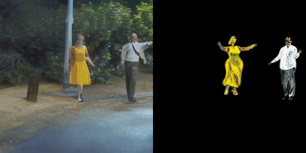

<p align="center">

  <h2 align="center">AMG: Avatar Motion Guided Video Generation</h2>
  <p align="center">
    <a href="https://scholar.google.com/citations?user=VaRp0cMAAAAJ&hl=en"><strong>Zhangsihao Yang</strong></a><sup>1</sup>
    ·  
    <a href="https://shanmy.github.io/"><strong>Mengyi Shan</strong></a><sup>2</sup>
    ·
    <a href=""><strong>Mohammad Farazi</strong></a><sup>1</sup>
    ·
    <a href=""><strong>Wenhui Zhu</strong></a><sup>1</sup>
    ·
    <a href=""><strong>Yanxi Chen</strong></a><sup>1</sup>
    ·
    <a href=""><strong>Xuanzhao Dong</strong></a><sup>1</sup>
    ·
    <a href=""><strong>Yalin Wang</strong></a><sup>1</sup>
    <br>
    <sup>1</sup>Arizona State University &nbsp;&nbsp;&nbsp; <sup>2</sup>University of Washington
    </br>
        <a href="https://arxiv.org/abs/2409.01502">
        
        </a>
        <a href='https://zshyang.github.io/amg-website/'>
        </a>
        <!-- <a href='https://youtu.be/VPJe6TyrT-Y'>
        </a> -->
     </br>
    <!-- <table align="center">
        
        
    </table> -->
</p>

_Human video generation is a challenging task due to the complexity of human body movements and the need for photorealism. While 2D methods excel in realism, they lack 3D control, and 3D avatar-based approaches struggle with seamless background integration. We introduce AMG, a method that merges 2D photorealism with 3D control by conditioning video diffusion models on 3D avatar renderings. AMG enables multi-person video generation with precise control over camera positions, human motions, and background style, outperforming existing methods in realism and adaptability._

## 0. Getting Started

### 0.1 Setting Up the `vgen` Virtual Environment

<details>
<summary>Two Methods</summary>

#### Method 1: With `sudo` Privileges

Follow the instructions from [vgen](https://github.com/ali-vilab/VGen).

You might need to install `diffusers` and other possible packages.

```bash
conda create -n vgen python=3.8
conda activate vgen

pip install torch==1.12.0+cu113 torchvision==0.13.0+cu113 torchaudio==0.12.0 --extra-index-url https://download.pytorch.org/whl/cu113

pip install -r requirements.txt -i https://pypi.tuna.tsinghua.edu.cn/simple

sudo apt-get update && apt-get install ffmpeg libsm6 libxext6  -y
```

#### Method 2: Using `slurm` and `mamba`

For slurm-based environments (`mamba` or `conda`), modified from [vgen](https://github.com/ali-vilab/VGen).

```bash
module load mamba/latest

module load cuda-11.3.1-gcc-12.1.0

mamba create -p /scratch/<user_id>/envs/vgen python=3.8 -y

mkdir -p /scratch/<user_id>/envs/vgen/opt
cd /scratch/<user_id>/envs/vgen/opt

git clone https://github.com/ali-vilab/VGen.git

pip install -r requirements.txt -i https://pypi.tuna.tsinghua.edu.cn/simple

pip install torch==2.2.0 torchvision torchaudio --extra-index-url https://download.pytorch.org/whl/cu113

python -m pip install diffusers==0.23.0
python -m pip install ffmpeg-python
```

</details>

### 0.2 Download Initialization Models

Download [model.zip](https://drive.google.com/file/d/1n979-fIwIBlxqavI_lJQFFrMUKcJwqjI/view?usp=sharing) to `_runtime` and unzip it.

## 1. Inference

### 1.1 Preparation

1. Download weight

The weights for inference could be downloaded from [here](https://drive.google.com/file/d/1g274tXyfaA45cy8IkaUJF39iVg5sQNTU/view?usp=sharing) (5.28GB).

2. Install `amg` package

Run the following command line for installing `amg` package.

```bash
pip install -e .
```

### 1.2 Try it out!

Once finish the steps above, you could try any of the following examples:

1. change background
2. move camera
3. change motion

<details>
<summary> <strong style="font-size: 1.10em;">1.2.1 Change Background</strong></summary>

Run the command below to get **change background** results:

```bash
python applications/change_background.py --cfg configs/applications/change_background/demo.yaml
```

The results are store under newly created folder `_demo_results/change_background`.
You should be able to see exact same results like the following:

<table align="center">
    <tr>
        <th style="text-align:center; width: 33%;">Input</th>
        <th style="text-align:center; width: 33%;">Reference</th>
        <th style="text-align:center; width: 33%;">Generated</th>
    </tr>
    <tr>
        <td colspan="3" align="center">
            
        </td>
    </tr>
</table>

</details>

<details>

<summary> <strong style="font-size: 1.10em;">1.2.2 Move Camera</strong></summary>

Run the command below to get **move camera** results:

```bash
python applications/move_camera.py --cfg configs/applications/move_camera/demo.yaml
```

The results are store under newly created folder `_demo_results/move_camera`.
You should be able to see exact same results like the following:

<table align="center">
    <tr>
        <th style="text-align:center; width: 50%;">Input</th>
        <th style="text-align:center; width: 50%;">Generated</th>
    </tr>
    <tr>
        <td colspan="2" align="center">
            
        </td>
    </tr>
</table>

</details>

<details>
<summary> <strong style="font-size: 1.10em;">1.2.3 Change Motion</strong></summary>

Run the command below to get **change motion** results:

```bash
python applications/change_motion.py --cfg configs/applications/change_motion/demo.yaml
```

The results are store under newly created folder `_demo_results/change_motion`.
You should be able to see exact same results like the following:

<table align="center">
    <tr>
        <th style="text-align:center; width: 50%;">Generated</th>
        <th style="text-align:center; width: 50%;">Input</th>
    </tr>
    <tr>
        <td colspan="2" align="center">
            
        </td>
    </tr>
</table>

</details>

## Traning

### Download data

1. Fill out [this google form](https://forms.gle/xrx4sfAn7QAWgiXq9) for reqeusting of the processed dataset in the paper.

2. Put the downloaded data under `_data`.

### Start training

```bash
python train_net_ddp.py --cfg configs/train.yaml
```

## Folder Structure

- configs
- demo_data
